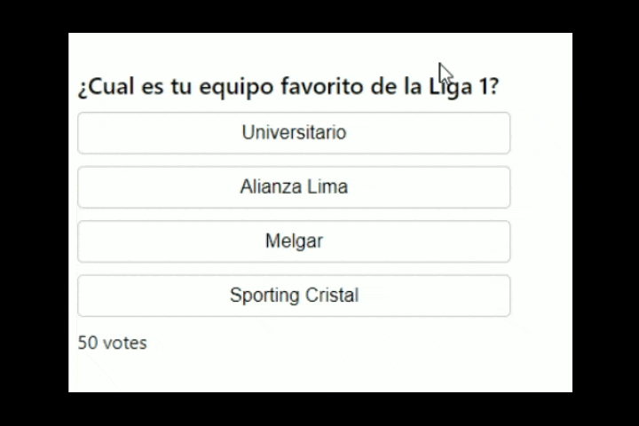

# React Twitter Poll

React-Twitter-Poll is a React library for creating polls like Twitter or Facebook. It is easy to use and flexible, and allows developers to create polls of different types, with different visualization options and analysis data.

[](https://standardjs.com)

[](https://github.com/salalo/react-leaf-polls/blob/master/LICENSE)

# 

## Install

### NPM

```bash
npm i react-twitter-poll
```

### Yarn

```bash
yarn add react-twitter-poll
```

## Usage

```ts
import React, { useState } from 'react';
import ReactTwitterPoll, { option } from 'react-twitter-poll';

const dataOptions = [
  {
    id: 0,
    text: "Universitario",
    votes: 18
  },
  {
    id: 1,
    text: "Alianza Lima",
    votes: 14
  },
  {
    id: 2,
    text: "Melgar",
    votes: 3
  },
  {
    id: 3,
    text: "Sporting Cristal",
    votes: 15
  }
]

function App() {
  const [options, setOptions] = useState([...dataOptions]);

  const handleVote = (item: option) => {
    const tempOptions = [...options];
    const index = tempOptions.findIndex(x => x.id === item.id);
    tempOptions[index].votes = tempOptions[index].votes + 1
    setOptions([...tempOptions])
  }

  return (
    <div className="App">
      <br />
      <ReactTwitterPoll
        title='¿Cual es tu equipo favorito de la Liga 1?'
        options={options}
        onVote={handleVote}
        //optionSelected={options[2]}
      />
    </div>
  );
}

export default App;

```

## License

MIT © [JosephSB](https://github.com/JosephSB)
